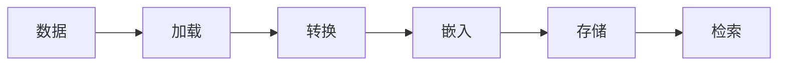

# RAG

检索增强生成（RAG）是一种结合`信息检索`和`文本生成`的 AI 技术。通常用来处理问答系统、对话生成或内容摘要等自然语言处理任务。

RAG 检索部分的 pipeline：

- 数据连接和加载：结构化和非结构化的数据都可以被 RAG 加载
- 转换：通过清洗、标准化和整理，把数据转换为统一格式
- 嵌入：通过词嵌入模型，将数据转换成某种词嵌入，也就是向量的形式
- 存储：将向量数据存储在某种形式的存储系统中，如向量数据库
- 检索：从存储系统中检索数据，以便进一步操作
