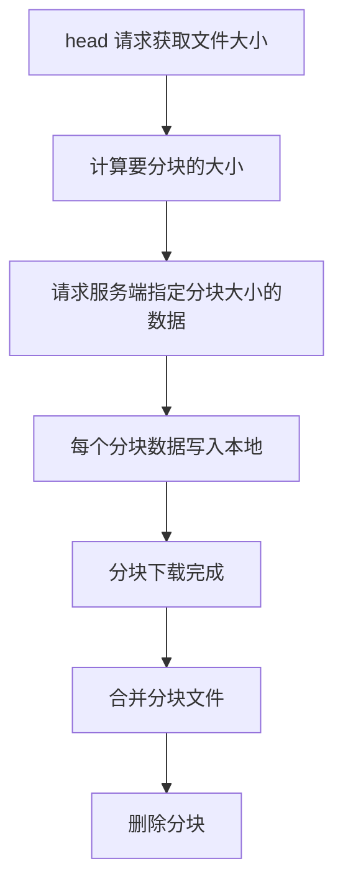

# 分块下载

最近在使用一个小工具下载文件的时候，遇到两个问题：
- 一个是代码在发起 Get 请求，提示 handshake timeout 的问题
- 一个是在将文件数据写入本地的时候，遇到 read:connection reset by peer 的问题

对于第一个问题，主要是在 client 里对 TLSHandshakeTimeout 设置一个较长的时间。

第二个问题主要是将原来的单一连接下载，拆成了分片下载，然后合并文件来处理。

分片下载的流程主要是：


```go
func DownloadFile2(url, dstPath string) error {

	// 创建一个临时目录用于存储分块文件
	tempDir := "./chunks"
	if err := os.MkdirAll(tempDir, os.ModePerm); err != nil {
		fmt.Println("DownloadFile2 Error creating temp directory:", err)
		return err
	}

	chunkSize := int64(1 * 1024 * 1024) // 每个分块 1 MB

	// 获取文件大小
	fileSize, err := getFileSize(url)
	if err != nil {
		fmt.Println("DownloadFile2 getting file size:", err)
		return err
	}

	fmt.Printf("fileSize: %d\n", fileSize)

	// 初始化同步等待组
	wg := sync.WaitGroup{}
	var chunkPaths []string

	fmt.Printf("DownloadFile2 start... dstPath: %s\n", dstPath)

	var downloadChunkErr error

	// 分块下载
	for i := int64(0); i < fileSize; i += chunkSize {
		end := i + chunkSize - 1
		if end >= fileSize {
			end = fileSize - 1
		}

		chunkPath := filepath.Join(tempDir, fmt.Sprintf("chunk-%d-%d", i, end))
		chunkPaths = append(chunkPaths, chunkPath)

		wg.Add(1)
		go func(start int64, end int64, chunkPath string) {
			err = downloadChunk(url, start, end, &wg, chunkPath)
			if err != nil {
				downloadChunkErr = err
				fmt.Printf("DownloadFile2 Error downloading chunkPath: %s, err: %+v\n", chunkPath, err)
			}
		}(i, end, chunkPath)
	}

	// 等待所有分块下载完成
	wg.Wait()

	if downloadChunkErr != nil {
		clearChunks(chunkPaths)
		fmt.Println("DownloadFile2 Error downloading chunk:", downloadChunkErr)
		return downloadChunkErr
	}

	fmt.Println("DownloadFile2 All chunks downloaded, merging files...")

	dir := filepath.Dir(dstPath)
	err = os.MkdirAll(dir, 0777)
	if err != nil {
		fmt.Printf("DownloadFile2 os.MkdirAll err: %v\n", err)
		return err
	}

	if err = mergeChunks(dstPath, chunkPaths); err != nil {
		fmt.Println("DownloadFile2 Failed to merge chunks:", err)
		return err
	}

	fmt.Println("DownloadFile2 and merge completed successfully")

	// 清理临时文件
	clearChunks(chunkPaths)
	return nil

}

func clearChunks(chunkPaths []string) {
	for _, chunkPath := range chunkPaths {
		os.Remove(chunkPath)
	}
}

// 合并分块文件
func mergeChunks(fileName string, chunkPaths []string) error {
	outFile, err := os.Create(fileName)
	if err != nil {
		return fmt.Errorf("error creating final file: %w", err)
	}
	defer outFile.Close()

	for _, chunkPath := range chunkPaths {
		inFile, err := os.Open(chunkPath)
		if err != nil {
			return fmt.Errorf("error opening chunk file %s: %w", chunkPath, err)
		}

		if _, err := io.Copy(outFile, inFile); err != nil {
			inFile.Close()
			return fmt.Errorf("error writing chunk to final file: %w", err)
		}

		inFile.Close()
	}

	return nil
}

// 获取文件大小
func getFileSize(url string) (int64, error) {
	resp, err := http.Head(url)
	if err != nil {
		return 0, err
	}
	if resp.StatusCode != http.StatusOK {
		return 0, fmt.Errorf("failed to get file size: %s", resp.Status)
	}
	return resp.ContentLength, nil
}

// 下载文件的分块
func downloadChunk(url string, start, end int64, wg *sync.WaitGroup, chunkPath string) error {
	defer wg.Done()

	var err error
	req, err := http.NewRequest("GET", url, nil)
	if err != nil {
		return fmt.Errorf("error creating request: %w", err)
	}

	req.Header.Set("Range", fmt.Sprintf("bytes=%d-%d", start, end))

	modifyTransport := http.DefaultTransport.(*http.Transport).Clone()
	modifyTransport.MaxIdleConns = 20
	modifyTransport.TLSHandshakeTimeout = 30 * time.Second // 改下握手超时时间
	client := &http.Client{Timeout: 90 * time.Second, Transport: modifyTransport}

	resp, err := client.Do(req)
	if err != nil {
		return fmt.Errorf("error downloading chunk: %w", err)
	}
	defer resp.Body.Close()

	if resp.StatusCode != http.StatusPartialContent && resp.StatusCode != http.StatusOK {
		return fmt.Errorf("unexpected status code: %d", resp.StatusCode)
	}

	// 创建分块文件并写入
	outFile, err := os.Create(chunkPath)
	if err != nil {
		return fmt.Errorf("error creating chunk file: %w", err)
	}
	defer outFile.Close()

	bufferedWriter := bufio.NewWriter(outFile)
	if _, err = io.Copy(bufferedWriter, resp.Body); err != nil {
		return fmt.Errorf("error writing chunk: %w", err)
	}

	if err = bufferedWriter.Flush(); err != nil {
		return fmt.Errorf("error flushing buffer: %w", err)
	}

	return nil
}
```