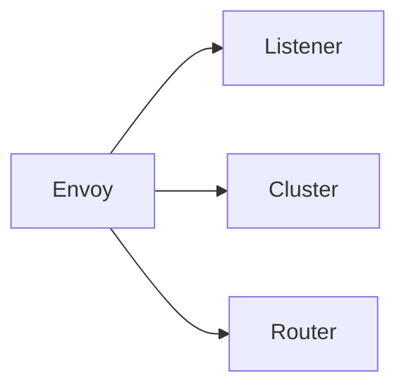
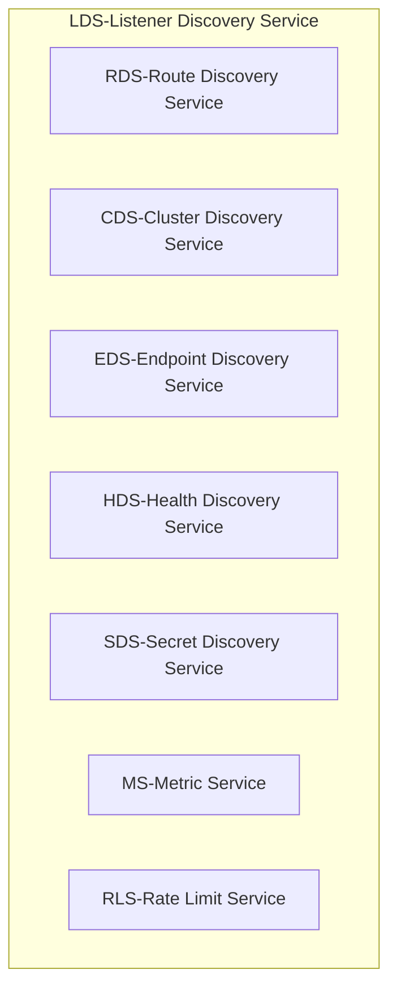
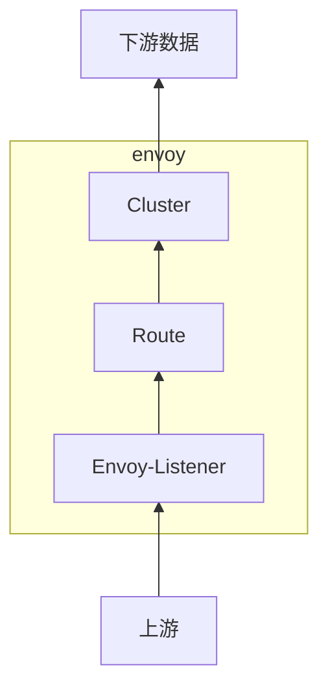

# Envoy 的三种资源

## Listener
Listener 负责接收来自下游的数据，就相当于在 Envoy 里做监听端口用，Envoy 可以同时支持多个 Listener，不同 Listener 之间的策略配置相互隔离。（主要指过滤链的配置）

也就是当数据从监听的端口进来后，会先经过 Listener 的过滤链。

其中 LDS 是自动发现Listener服务，是所有其它 xDS 协议的基础，没有 LDS，也就意味着 Envoy 没有监听端口，那 Envoy 就不能为任何应用提供服务了，整个 xDS 服务就没有意义。

## Cluster
Cluster 是 Envoy 能够连接到的`一组` `逻辑`上提供`相同服务`的`上游主机`，Cluster 包含该服务的连接池、超时时间、Endpoints 地址、端口等信息，相当于 k8s 里的 Service。承担`服务发现`的职责。换种说法，Cluster 定义哪些主机是属于一个服务。

如果 Cluster 的类型标识为需要 CDS，表示控制平面会将它从外部环境中获取的所有可访问服务全量推送给 Envoy。

如果 Cluster 的类型标识为需要 EDS，说明该 Cluster 的所有 Endpoints 地址应该由 xDS 服务下发，而不是依靠 DNS 去解析。

## Router
Router 决定 Listener 在接收到下游的数据后，具体应该将数据交给哪个 Cluster。

在配置上，就是目标Cluster及其匹配规则，实现网关的路由职能。

