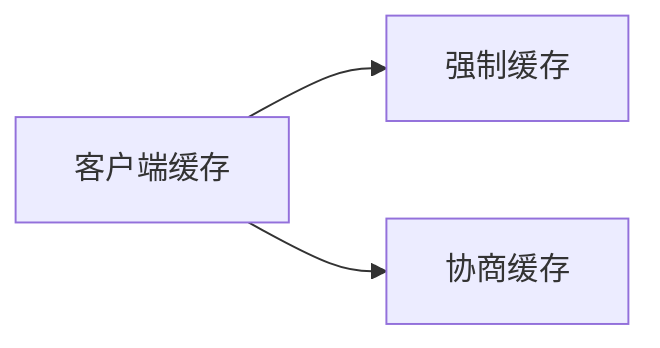
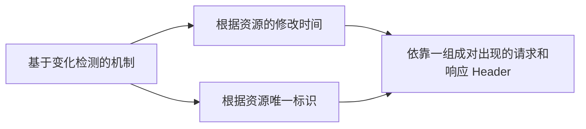

# 客户端缓存
内容来自《凤凰架构》


## 强制缓存
基于时效性。

HTTP 里有两类 Header 实现强制缓存。
### Expires
```bash
HTTP/1.1 200 OK
Expires: Wed, 8 Apr 2020 07:28:00 GMT
```
缺点：
- 受限于客户端时间
  - 客户端改了本地时间，就无效了
- 无法处理涉及到用户身份的私有资源
  - 有些资源客户端可以缓存，但 CDN、代理不应该缓存
- 无法描述“不缓存”的语义
  - 有些资源不想缓存，这做不到

### Cache-Control
```bash
HTTP/1.1 200 OK
Cache-Control: max-age=600
```
它有一些主要的参数
- max-age, s-age(s means share)
  - 以秒来设置，就不会受客户端本地影响
  - s-age 是给 CDN、代理这些看的
- public，private
  - public 可以被 CDN、代理等缓存
  - private 只能由客户端缓存
- no-cache，no-store
  - 前者表示不应该缓存，即时是同一会话的同一个 URL 地址的请求，也需要从服务端获取
  - 后者不强制会话中相同 URL 的重复获取，但禁止浏览器、CDN 等保存该资源
- no-transform：
  - 禁止资源被任何形式地修改

## 协商缓存
基于变化检测的缓存机制。



- Last-Modified 和 If-Modified-Since
  - Last-Modified 由服务端响应返回给客户端
  - If-Modified-Since 由客户端将服务端前面给的的数据发送给服务端


```bash
HTTP/1.1 304 Not Modified
Cache-Control: public, max-age=600
Last-Modified: Wed, 8 Apr 2020 07:28:00 GMT

HTTP/1.1 200 OK
Cache-Control: public, max-age=600
Last-Modified: Wed, 8 Apr 2020 07:28:00 GMT
```

- Etag 和 If-None-Match
  - Etag 由服务端的响应返回
  - If-None-Match 由客户端将 Etag 的值传给服务端


