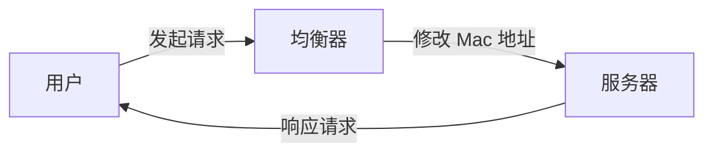

# 负载均衡
负载均衡形式上分为两种（以 OSI 七层模型）：
- 四层（传输层：即 TCP、UDP等）负载均衡
- 七层（应用层：即 HTTP、FTP等）负载均衡

两个简要的印象
- 四层的优势是性能高，七层的优势是功能强
- 做多级混合负载均衡，通常应是低层的负载均衡在前，高层的在后

---
`OSI 七层模型`

| 层     | 数据单元  |
|-------|-------|
| 应用层   | 数据    |
| 表达层   | 数据    |
| 会话层   | 数据    |
| 传输层   | 数据段   |
| 网络层   | 数据包   |
| 数据链路层 | 数据帧   |
| 物理层   | 比特流   |
---

## 数据链路层负载均衡
修改请求的数据帧中的 MAC 目标地址，指向真实的服务器。

但因为只改了低层的数据，不涉及上层，故目的 IP 地址不会变。因此需要把真实的物理服务器集群里的所有机器的虚拟 IP 地址配置成与负载均衡器的的虚拟 IP 一样。

最后直接由目标服务器响应客户端。

这种“三角关系”称为“单臂模式”或“直接路由”。

优点：
- 效率高
缺点：
- 必须位于同一子网（因为必须是二层可达）

## 网络层负载均衡
通过改变 IP 地址实现数据包的转发。

两种常见的修改方式：
- 保持原数据包不变，新创建一个数据包，将原来的 Headers 和 Payload 作为新包里的 Payload，新包的 Headers 写入真实服务器的 IP。然后真实服务器要在入口处做针对性的拆包。
  - 这称为“IP隧道”。
- 直接改变 Headers 里的目标 IP 地址
  - 但服务端如果直接响应客户端，会客户端不认识该 IP，无法正常应答，因此需要原路返回
  - 这称为 NAT （网路地址转换）

---

四层负载均衡都属于“转发”，四层之后就无法转发，只能“代理”了

---

### 应用层负载均衡
可以实现的功能：
- CDN
- 智能化路由
- 抵御某些安全攻击，例如 DDoS
- 微服务的链路治理：服务降级、熔断、异常注入