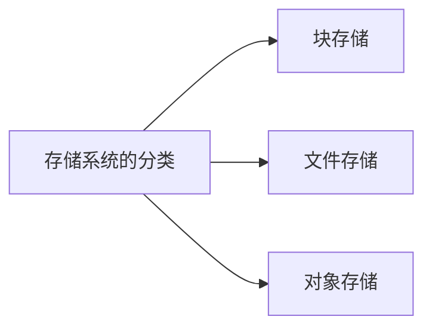

# 存储系统的分类
内容来自《凤凰架构》

## 块存储
最古老的形式，数据储存在固定长度的一个或多个块中，想要读写访问数据，就必须使用与存储相匹配的协议（SATA、SAS、iSCSI 等）。

块存储贴近底层硬件，没有文件、目录、访问权限等羁绊，故性能最高。一般是操作系统通过块设备来访问硬盘，大多数应用程序还是基于文件来操作数据。

块存储具有排他性，一旦块设备被某个客户端挂载后，其它客户端就无法访问上面的数据了。

## 文件存储
最贴近人类用户的数据存储形式，不像块存储有多种协议，而是使用 POSIX 接口。

可以近似认为文件是由块所组成的更高级存储单位。规定不变的文件可以使用连续块存储，会发生变动的文件则要将块组成链表结构，然后对链表指针做统一管理。

文件储存的树状结构和路径访问方式方便人类理解、记忆和访问；但也因为这样，在性能上也会有所影响。

## 对象存储
`对象`指的是一个元数据及与其配对的一个逻辑数据块的组合，元数据提供了对象所包含的上下文信息，数据块则存储了具体的内容。

基本只在分布式系统上实现。对象的元数据仅描述对象本身，与其它对象没有关联，故没有目录的概念，天然扁平化。

实际上许多对象存储会提供 Bucket 概念，相当于是一个单层目录。

