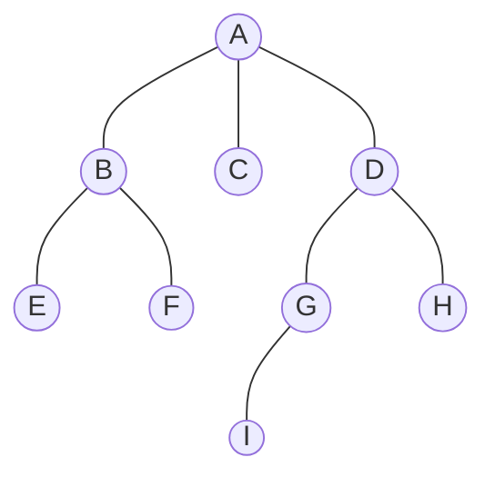
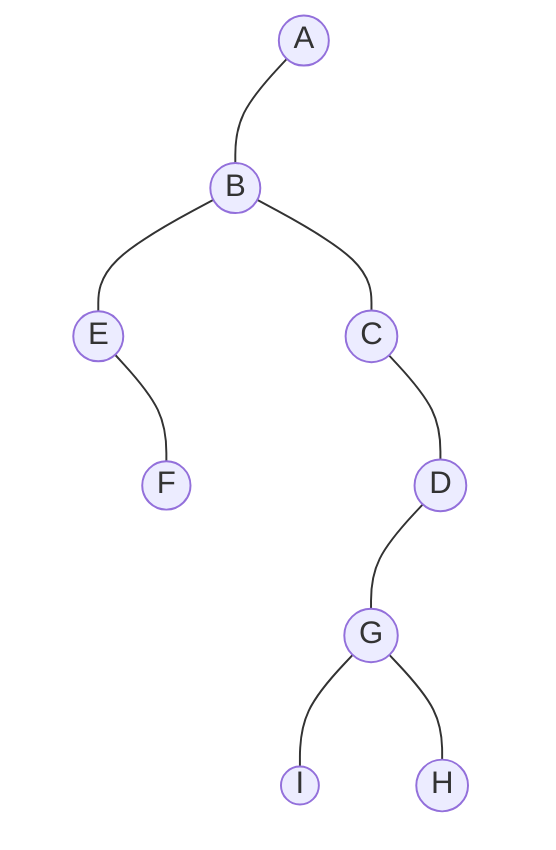
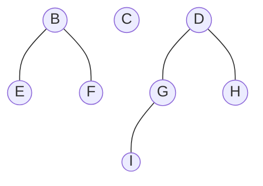
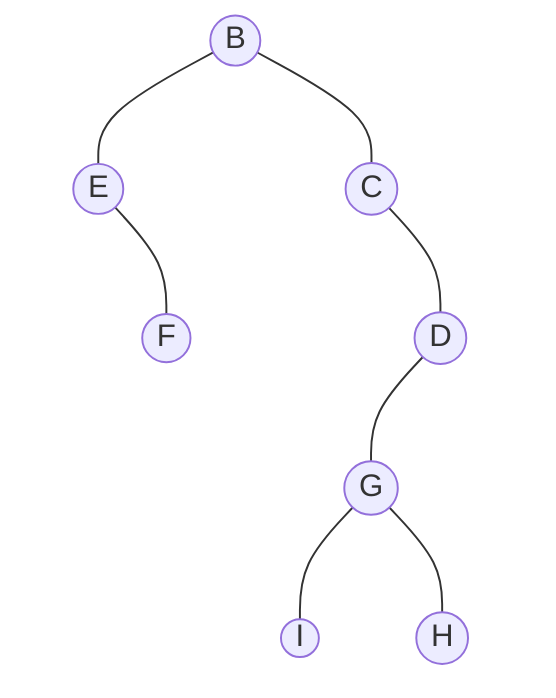

# 树&森林转换为二叉树
> 长子当做左孩子，兄弟关系向右斜。

## 树转二叉树

```mermaid
graph TD
    A((A))
    B((B))
    C((C))
    D((D))
    E((E))
    F((F))
    G((G))
    H((H))
    I((I))
    A --- B
    A --- C
    A --- D
    B --- E
    B --- F
    D --- G
    D --- H
    G --- I
    G --- I1(( ))
    
    style I1 fill:#f100,stroke-width:0px
    linkStyle 8 stroke:#0ff,stroke-width:0px 
```

```mermaid
graph TD
    A((A))
    B((B))
    C((C))
    D((D))
    E((E))
    F((F))
    G((G))
    H((H))
    I((I))
    
    A --- B
    A --- B1(( ))
style B1 fill:#f100,stroke-width:0px
linkStyle 1 stroke:#0ff,stroke-width:0px  
    B --- E
    E --- F1(( ))
style F1 fill:#f100,stroke-width:0px
linkStyle 3 stroke:#0ff,stroke-width:0px  
    E --- F
    B --- C
    C --- D1(( ))
style D1 fill:#f100,stroke-width:0px
linkStyle 6 stroke:#0ff,stroke-width:0px 
    C --- D
    D --- G
    D --- G1(( ))
style G1 fill:#f100,stroke-width:0px
linkStyle 9 stroke:#0ff,stroke-width:0px 
    G --- I
    G --- H
 
```
## 森林转二叉树

```mermaid
graph TD
    B((B))
    C((C))
    D((D))
    E((E))
    F((F))
    G((G))
    H((H))
    I((I))
    
    B --- E
    B --- F
    D --- G
    G --- I
    G --- I1(( ))
    D --- H

style I1 fill:#f100,stroke-width:0px
linkStyle 4 stroke:#0ff,stroke-width:0px
```

```mermaid
graph TD

    B((B))
    E((E))
    C((C))
    D((D))
    F((F))
    G((G))
    H((H))
    I((I))
    
    B --- E
    E --- F1(( ))
style F1 fill:#f100,stroke-width:0px
linkStyle 1 stroke:#0ff,stroke-width:0px
    E --- F
    B --- C
    C --- D1(( ))
style D1 fill:#f100,stroke-width:0px   
linkStyle 4 stroke:#0ff,stroke-width:0px
    C --- D
    D --- G
    D --- G1(( ))
style G1 fill:#f100,stroke-width:0px   
linkStyle 7 stroke:#0ff,stroke-width:0px
    G --- I
    G --- H
```