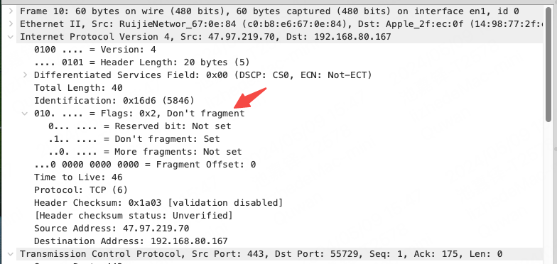

# MTU
> 最大传输单元MTU（Maximum Transmission Unit，MTU），是指网络能够传输的最大数据包大小，以字节为单位。MTU的大小决定了发送端一次能够发送报文的最大字节数。如果MTU超过了接收端所能够承受的最大值，或者是超过了发送路径上途经的某台设备所能够承受的最大值，就会造成报文分片甚至丢弃，加重网络传输的负担。如果太小，那实际传送的数据量就会过小，影响传输效率。

MTU 的默认值是 1500。

在 Mac 上，我们可以手动通过网络-硬件进行调整：

这里说 MTU 如果超过了某台设备承受的最大值，可能造成报文分片或丢弃，这里需要看这个报文里是否有携带 DF 标志（Do Not Fragment），如果有，则报文会被丢弃，如果没有，则报文会被分片。

常见的判断丢包问题是来自于 MTU 的条件是：
- 持续性的丢包
- 丢的都是字节比较大的包
- 把网卡的 MTU 改小可以解决问题